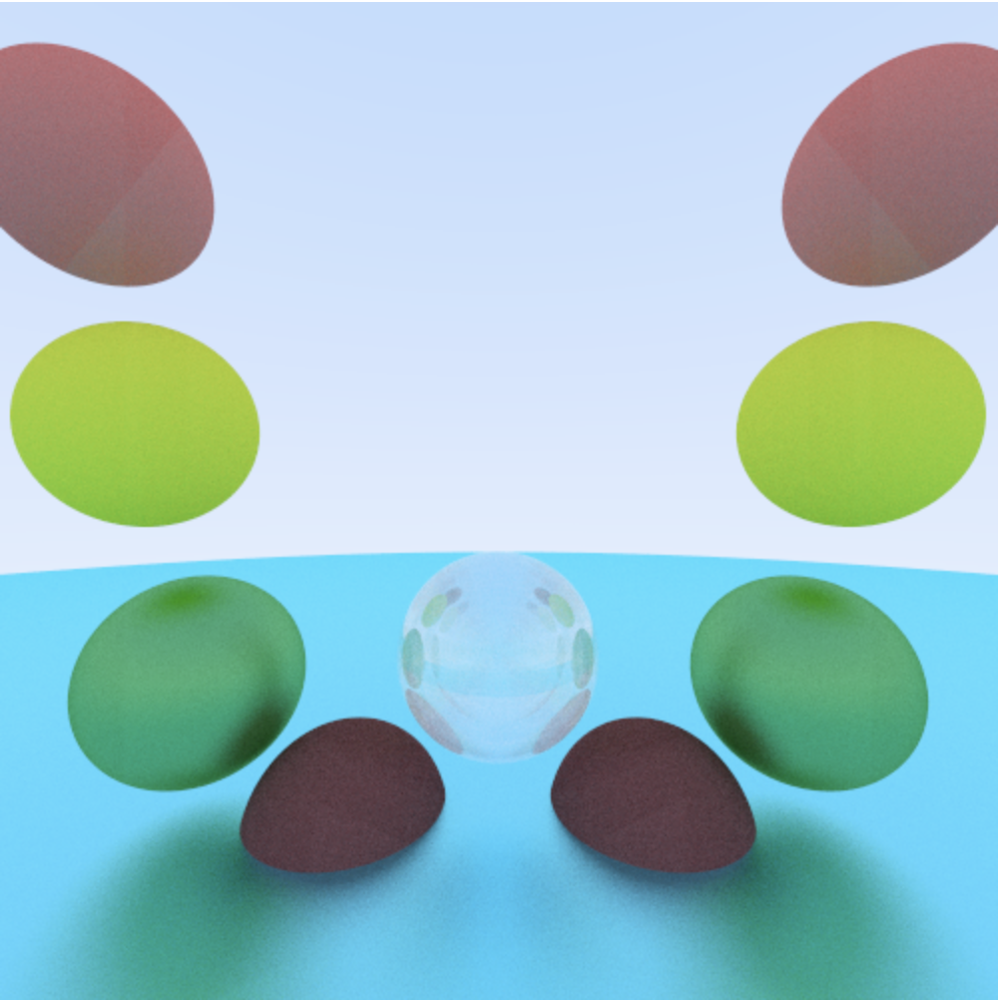
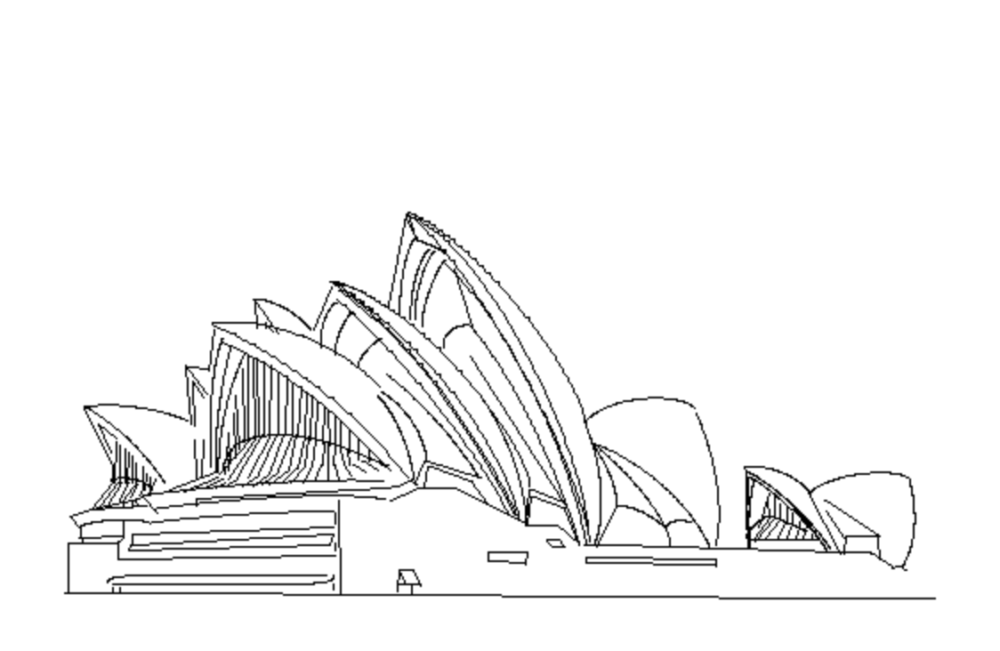
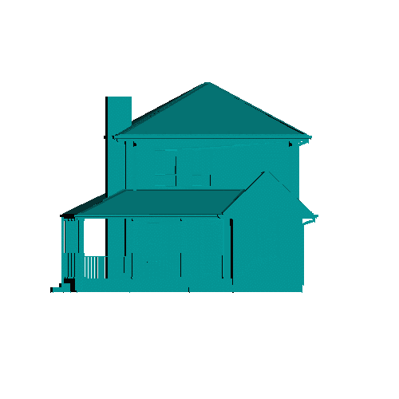

# graphics-final

## Repository for holding my assignments for Stuyvesant High School Computer Graphics Course
Computer graphics is a post AP Computer Science course where we wrote our own graphics engine from scratch in a language of our choice (I chose Typescript). We covered topics like line/curve drawing algorithms, Phong shading, animations, and more. For my final assignment, I chose to learn and implement ray tracing.

## Team
- Team Name: House Graphics
- Team Members: William Cao Period 10

## Sample images:
### Ray traced image

### Bezier curves and lines

### Animation and .obj files


## Feature Implemented
- Antialiasing with raytracing. Supported materials are: glass, metal, and diffuse.

## How to edit script.mdl?
- Please have "shading raytrace" as the first line of the mdl file.
- The only supported shape is a sphere. The command should formatted as:
```
sphere x y z radius material red green blue reflectionIndex|fuzz
```
- If the "material" is glass:
    - Put positive value for reflection index (last argument)
    - Reflection index: https://en.wikipedia.org/wiki/List_of_refractive_indices
    - put any random NUMBER for "red", "green", and "blue" field
- If the "material" is diffuse:
    - put any NUMBER for last argument
- If the "material" is metal:
    - last value is "fuzz" positive value from 0 to 1 exclusive. fuzziness of reflection from metal
- The screen is -1 to 1 by -1 to 1 (and not 500x500).
- The camera is located at (0, 0, 0), so use negative z values
- The program will display where the program is currently at like so:
    ```
    Finished pixel 239000 of 250000 (0.956)
    ```
  This means it is 95.6% done, and has finished 239,000 pixels of 250,000.

## How do I run this?
### WARNING: THIS PROGRAM TAKES A LONG TIME TO RUN AND IS CPU INTENSIVE :)
0. I assume you can compile typescript, have npm installed, and imagemagik working. Use macOS or a linux distro. 
1. Clone the repo and change directory into it
    ```
    git clone https://github.com/WilliamC07/graphics-final.git && cd graphics-final.git
    ```
2. Run make
    ```
    make
    ```
3. Open the image created (asd.png)

## Source
- I followed [this guide (Ray tracing in one weekend)](https://raytracing.github.io/books/RayTracingInOneWeekend.html).
    - The guide was in c++

## Proposed Features
- Ray tracing
    - [Online guide](https://www.scratchapixel.com/lessons/3d-basic-rendering/introduction-to-ray-tracing)
    - [Another one](https://raytracing.github.io/books/RayTracingInOneWeekend.html)
    - I can expand on this to include more reflection types (transparency, water bending light, etc...), or until
    my computer takes too long to run the program when debugging.
- Supporting .obj texture (when I get ray tracing to work)
    - I already have .obj support from past assignments, and it supports converting quadrilateral faces to 2 triangular faces.
    - Texture mapping 
        - Javascript parsing of **.png** files [library](https://www.npmjs.com/package/pngjs)
        - Javascript parsing of **.jpeg** files [library](https://www.npmjs.com/package/jpeg-js)
